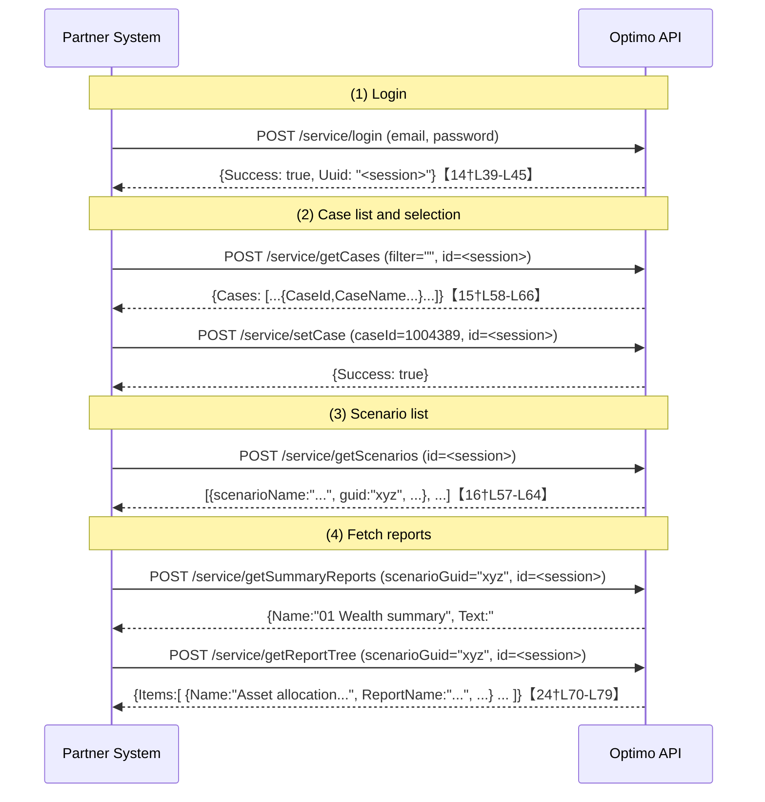
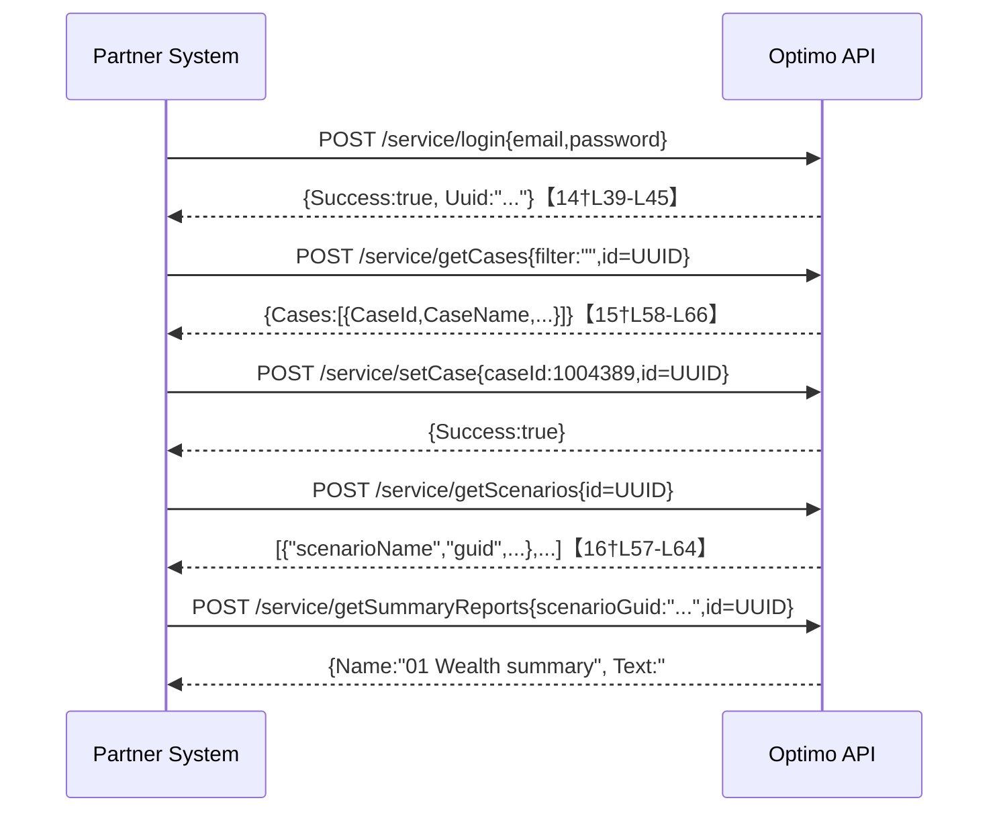
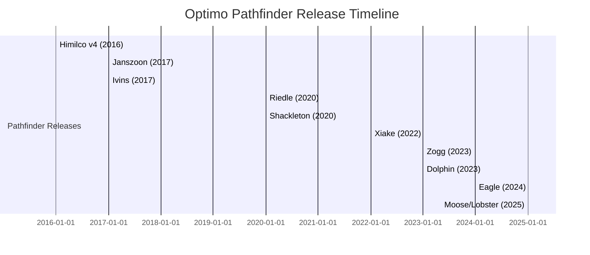

# Executive Summary  
The **Optimo API** (by Optimo Financial Pty Ltd) is a JSON-based web service for integrating external systems with the Optimo *Pathfinder* financial planning application【2†L17-L25】.  It comprises two parts: an *Input API* (push client data into Pathfinder) and an *Output API* (exporting Pathfinder results back to the partner)【2†L17-L25】.  Authentication is via a partner-specific login (email/password) that returns a session UUID, which must be included in all subsequent requests【14†L39-L45】【31†L42-L50】.  The API is organized by functional groups (Cases, Scenarios, Input, Output, Reports, etc.) with each function exposed at endpoints under `/service/...`.  All calls (except file downloads) use HTTPS POST with JSON payload (the documentation’s `OnGetJson` helper always appends `?id=<Uuid>` to the URL)【31†L42-L50】.  

End-to-end use typically flows as follows: a partner calls `/service/login`, then `/service/getCases` and `/service/setCase` to pick a case, then `/service/getScenarios` to select a solved scenario, and finally calls summary/report endpoints (e.g. `/service/getSummaryReports`, `/service/getReportTree`, etc.) to retrieve the results data【14†L39-L45】【42†L124-L132】.  Example requests and JSON responses are provided in the official docs (see below).  Rate limits are *not publicly documented*; error handling appears to use an HTTP 401 for unauthorized access and a JSON `Success/Message` pattern for failures【14†L39-L45】【31†L42-L50】.  There are no known official SDKs; sample JavaScript code is provided in the docs.  No webhooks/events or special retry semantics are described.  Pricing or tiered limits (cases/quota) are not documented beyond the note that partners must request access; the sandbox uses “cases” (simulations) that can be purchased for testing【40†L39-L48】.  Security best practices follow typical API patterns (use HTTPS, protect credentials, rotate session UIDs, etc.); the API itself avoids cookies (preventing XSS/XSRF) by requiring the session Uuid on each call【14†L39-L45】.  Notably, Optimo Pathfinder was **discontinued in Aug 2024**【6†L6-L14】, so the API is effectively legacy, though documentation and release notes remain available.  Version history is tracked by Pathfinder “releases” (codenames like **Himilco**, **Janszoon**, **Zogg**, **Dolphin**, **Eagle**, etc.), but no separate API version numbers are exposed. Community support is limited to official channels; no public GitHub/StackOverflow presence is found.  In summary, the Optimo API is a partner-only JSON API for case data exchange with Pathfinder, now largely obsolete but documented as above (see official docs for details【2†L17-L25】【14†L39-L45】).

## Official Documentation & Developer Portal  
Optimo’s API documentation is hosted on the Optimo Pathfinder Confluence site.  The main “API Documentation for Developers” page (partners only) is at **help.optimopathfinder.com.au/API/web/**【1†L15-L24】. Key sections include an *Overview*【2†L17-L25】 and function reference pages (Login, Cases, Input, Output, Reports, etc.)【13†L29-L38】.  A sandbox and **API Test View** are available for hands-on exploration: the sandbox site is at **https://sandbox.optimopathfinder.com.au/**【40†L29-L33】 (login required), and an interactive “API Test” UI guides partners through calling functions【40†L68-L77】【42†L124-L132】.  (The API Test view and sample code zip can be downloaded from the docs.)  

**Developer Portal URLs:**  The primary URLs are: the Pathfinder user docs homepage (with API docs link)【4†L13-L17】, the API docs space at `help.optimopathfinder.com.au/API/web`, and the sandbox login at *sandbox.optimopathfinder.com.au*.  For reference, Optimo Financial’s corporate site is `optimofinancial.com.au`, though it contains no public API docs.  Note: *“Optimo API”* may also refer to an unrelated UK product (Optimo Ticketing) whose API (OPTIMO V4) uses JSON:API【5†L55-L63】; that is a different system.  All information here pertains to the Pathfinder API.  

## Authentication  
The API uses a custom session-based authentication: partners must POST credentials to **`/service/login`** with JSON `{ "email": "...", "password": "..." }`.  The response is JSON with `Success` (bool), a `Message` if unsuccessful, and a **`Uuid`** string if successful【14†L37-L45】.  **Example:**  

```http
POST /service/login HTTP/1.1
Content-Type: application/json

{ "email": "partner@example.com", "password": "Pa$$w0rd" }
```

Response (JSON):  
```json
{ 
  "Success": true,
  "Uuid": "abcd1234-ef56-7890-ghij-1234567890ab",
  "Message": ""
}
```  
The returned `Uuid` is the session ID for all further requests; cookies are **not** used (avoiding XSS/XSRF issues)【14†L39-L45】.  Once logged in, the session remains active as long as API calls occur within 20-minute intervals【14†L41-L47】. 

All subsequent API calls must include this session Uuid. In the JavaScript examples, requests are made via a helper that appends `?id=<Uuid>` to every URL. For example, the provided `OnGetJson` function constructs calls like:  
```javascript
$.ajax({
  url: baseUrl + url + '?id=' + _uuid,
  type: 'POST', contentType: 'application/json', data: JSON.stringify(data),
  ...
});
```  
【31†L42-L50】. In other words, **every** POST to `/service/<function>` should add the query parameter `id=<sessionUuid>`.  (Two output endpoints – downloading the strategy Word paper and YAML – are invoked via HTTP GET with `?id=<Uuid>` in the query【29†L7-L16】【22†L206-L214】.) 

*Authentication summary:* Email/password login to `/service/login` (POST) yields a `Uuid` token【14†L39-L45】.  Attach `?id=<Uuid>` to all subsequent calls (typically via POST JSON)【31†L42-L50】. No OAuth or API keys are used – authentication is partner-specific and session-based. 

## API Endpoints  

The API is organized by resource group.  Below is an overview of all endpoints (grouped by function), with HTTP method, required parameters, and a brief description.  (All parameters below are passed as JSON fields in the request body, unless noted.) Tables at the end of this section summarize the endpoints and their usage. Example request/response snippets from the documentation are shown where helpful.  

- **Login:** `POST /service/login`.  Required JSON body: `{ email, password }`.  Returns `{ Success, Uuid, Message }`【14†L37-L45】.  (Used to create a session.)  

- **Cases:** For managing case selection.  
  - `POST /service/getCases`.  Body: `{ filter: "" }` (filter is optional).  Returns `{ Success, IsSuperUser, Cases: [ {CaseId, CaseName, ...}, ... ] }`. Example:  
    ```json
    { 
      "Success": true,
      "IsSuperUser": false,
      "Cases": [
        {
          "CaseId": 1004389,
          "CaseName": "DEMO Robert and Alice",
          "CaseType": "Web-Solve",
          "DateCreated": "16-Mar-2022",
          "DateExpiry": "15/04/2022",
          ...
        }
      ]
    }
    ```【15†L58-L66】.  
  - `POST /service/setCase`.  Body: `{ caseId: <id> }`.  No body content is returned (or just success).  This sets the “current case” to work with (by the given CaseId)【15†L81-L90】.  

- **Scenarios:**  
  - `POST /service/getScenarios`.  Body: `{}` (no parameters besides the `id` in query).  Returns an array of scenarios in the current case:  
    ```json
    [
      { "scenarioName": "Keep super & Buy property", 
        "guid": "5736d816-5ae3-4f7e-8727-52ffb154dc4b",
        "analysisYears": 20
      },
      { "scenarioName": "New SMSF w Property", "guid": "", "analysisYears": 20 },
      ...
    ]
    ```【16†L57-L64】.  Each scenario object has `scenarioName`, a `guid` (non-empty if the scenario has been solved, else blank), and `analysisYears`.  The `scenarioGuid` is used in result-fetching calls; an empty GUID means no results yet.

- **Input API (New):** Create or retrieve case data in the new (JSON) format.  
  - `POST /service/pushCase`.  Body: JSON object representing the entire case (fact-find data, proposals, etc.) in *Pathfinder’s JSON schema*.  If creating a new case, omit `caseId` or set it null; to update, include `caseId=<existingId>` as a query parameter or part of the URL (the sample code adds it like `/service/pushcase?caseId=123`). Returns JSON indicating success and new or updated `caseId`. (No example JSON is given in docs, but it is symmetrical to `getBaseCase`.)  
  - `POST /service/getBaseCase`.  Returns the current case data (as last set by `setCase`) in JSON format. (Useful for a “round-trip” test to compare what was pushed.)  
  - `GET /service/getYaml?id=<Uuid>`.  **Note:** This is invoked via `window.location` in the sample code【29†L7-L16】.  It returns the current case’s data as a YAML file download, in the same input schema.  
  These endpoints let a partner push a client case into Pathfinder or retrieve it.  (A **Legacy Input API** also exists for older JSON formats: `/service/pushLegacyCase` and `/service/getLegacyCase`【17†L54-L62】【17†L68-L77】, but partners are encouraged to use the new Input API instead.)  

- **Strategy Summary (Output API – JSON):** These endpoints retrieve the *results* for a solved scenario, similar to the “Strategy summary” page in Pathfinder【18†L29-L37】.  All require `scenarioGuid` as a parameter.  
  - `POST /service/getAssumptionsReport`.  Body: `{ scenarioGuid: "<guid>" }`.  Returns a JSON “table” of assumptions, with columns and text (see example in [18†L79-L87]). Data fields include `ColNames`, `SectionName`, and `Data` rows with text and formatting tags【18†L79-L87】.  
  - `POST /service/getSummaryReports`.  Body: `{ scenarioGuid: "<guid>" }`.  Returns an array of objects for each summary section. Each object has `"Name"`, `"Text"` (bullet text with markup), an array `"Charts"` (with chart names/IDs), and `"OwnerName"`.  For example, a “Wealth summary” section object looks like:  
    ```json
    {
      "Name": "01 Wealth summary",
      "Path": "...",
      "ReportName": "WealthSummary",
      "Text": "#h2 Wealth summary\r\n#b1 Total net wealth... (etc.)",
      "Charts": [
         { "Name": "Assets and Loans", "Chart": "WealthSummary\\Assets and Loans" },
         { "Name": "Assets Distribution", ... }
      ],
      "OwnerName": "Consolidated"
    }
    ```【18†L179-L187】.  (The `Text` field contains the report narrative with simple markup codes, and `Charts` lists any charts in that section.)  
  - `POST /service/getChartRawData`.  Body: `{ scenarioGuid: "<guid>", reportPath: "<path>", chart: "<chartName>" }`.  Returns the raw data series for a specific chart (name and path from the summary or report list). For example:  
    ```json
    {
      "Data": [
        {
          "ColNames": ["", "Total assets"],
          "SectionName": "",
          "Data": [
            ["2021/22", 2316364.04],
            ["2022/23", 2446353.36],
            ...
          ]
        }
      ]
    }
    ```【20†L297-L305】.  
  - `POST /service/getActionItems`.  Body: `{ scenarioGuid: "<guid>" }`.  Returns an array of action-item tables. Each item has a `ReportName` (e.g. “Action items 2021/22”) and `Data` (formatted similarly to the reports). Example snippet:  
    ```json
    [
      {
        "ReportName": "Action items 2021/22",
        "Data": [
          {
            "ColNames": ["Messages", "Presentation"],
            "SectionName": "Action items 2021/22",
            "Data": [
              ["Robert, in 2021/22 it is recommended you do the following:", "s:h1"],
              ["Make a voluntary pre-tax contribution of $1,026...", "f:normal"],
              ...
            ]
          }
        ]
      }
    ]
    ```【20†L375-L384】【20†L389-L397】.  

- **Output API (Tables and Reports):** These endpoints export the *detailed report tables* and strategy paper, akin to downloading complete reports.  
  - `POST /service/getReportList`.  Body: `{}`. Returns a list of all available report names and chart IDs (not case-specific). The output JSON has two arrays, `Tables` and `Charts`, each listing report/chart identifiers (see [21†L61-L69]). Example:  
    ```json
    {
      "Tables": ["Cash flows (detailed)", "Insurance premiums summary", ...],
      "Charts": ["WealthSummary\\Assets and Loans", "CashReserveSummary\\Balance", ...]
    }
    ```【21†L61-L69】.  
  - `POST /service/getDataFromReportList`.  Body: JSON containing arrays `Tables` and `Charts` (as given by `getReportList`), plus `scenarioGuid`. For example:  
    ```javascript
    data = JSON.parse($("#resultjson").html()); // data.Tables, data.Charts
    data.scenarioGuid = guid;
    OnGetJson('/service/GetDataFromReportList', data);
    ```【21†L119-L127】.  This returns a large JSON object with `Tables` and `Charts` arrays of results. Each table object includes `ReportName`, `ReportPath`, `OwnerName`, and `Data` (table rows with columns). An abbreviated example for one table:  
    ```json
    {
      "Tables": [
        {
          "ReportName": "Cash flows (detailed)",
          "ReportPath": "Data\\Actual value reports\\INDL: Robert Demo\\Cash flows (detailed)",
          "OwnerName": "Individual\\Robert Demo",
          "Data": [
            { "ColNames": ["", "", "2022/23", "2023/24", ...], "Data": [ [...], [...], ... ] }
          ]
        },
        ...
      ]
    }
    ```【21†L172-L180】.  
    (Note: If multiple entities share the report name, `ReportPath` and `OwnerName` differentiate them – e.g. consolidated totals vs individual.)  
  - `GET /service/getStrategyPaper`.  This returns the full strategy paper as a Word `.docx` document. It is called via a browser redirect with query parameters: e.g.  
    ```
    window.location = "/service/getStrategyPaper?caseId=1234&scenarioGuid=abcd-...";
    ```【22†L206-L214】.  It does *not* return JSON but a file download (Word doc).

- **Detailed Reports:** These calls retrieve the raw tables for any specific report (as seen in the Detailed Reports section of the UI).  
  - `POST /service/getReportTree`.  Body: `{ scenarioGuid: "<guid>" }`.  Returns a hierarchical “tree” of report names/paths for building a menu. Example (abbreviated):  
    ```json
    {
      "Items": [
        {
          "Name": "Asset allocation",
          "Path": "Data\\Actual value reports\\INDL: Consolidated\\Asset allocation",
          "Report": "-9223372002495035598",
          "ReportName": "Client Asset allocation: Overall $",
          "Css": "page",
          "Items": [ ... ]
        },
        ...
      ]
    }
    ```【24†L70-L79】.  
  - `POST /service/getReport`.  Body: `{ scenarioGuid: "<guid>", reportpath: "<full report path>" }`.  Returns the data table for that report. The JSON includes `ColNames`, `SectionName`, and `Data` rows similar to above. Example (abbreviated):  
    ```json
    {
      "Data": [
        {
          "ColNames": ["", "", "2021/22", "2022/23", ..., "Presentation"],
          "SectionName": "Asset Allocation: Overall (Excluding Family Home)",
          "Data": [
            ["Asset class", "", null, null, ..., "f:normal;s:h1"],
            ["", "Australian cash", 74882.82, 120969.99, ... , "f:normal"],
            ...
          ]
        }
      ]
    }
    ```【24†L131-L140】【24†L184-L192】.  (The report tree must be queried first to know valid `reportpath` values.)  

**Endpoint Summary Tables:** For convenience, the key endpoints are summarized below.  In each case, use HTTPS and include `?id=<sessionUuid>` on the URL.  

| **Resource / Function**        | **Endpoint (Method)**      | **Required Params**                                 | **Response**                                 |
|:-------------------------------|:---------------------------|:----------------------------------------------------|:---------------------------------------------|
| *Authentication*               | `/service/login` (POST)    | JSON `{ email, password }`                        | `{ Success (bool), Uuid (session ID), Message }`【14†L37-L45】 |
| *Case Management*              | `/service/getCases` (POST) | `{ filter?: string }`                             | `{ Success, IsSuperUser, Cases: [ {...} ] }` (list of cases)【15†L58-L66】 |
|                                | `/service/setCase` (POST)  | `{ caseId: <number> }`                            | `{ Success }` (sets current case)            |
| *Scenarios*                    | `/service/getScenarios` (POST) | `{ }`                                           | Array `[ { scenarioName, guid, analysisYears }, ... ]`【16†L57-L64】 |
| *Input API (new)*              | `/service/pushCase` (POST) | Case JSON (optionally `?caseId=...`)             | `{ Success, caseId }` (push new/existing case) |
|                                | `/service/getBaseCase` (POST) | `{ }`                                           | Case JSON (current case data)               |
|                                | `/service/getYaml` (GET)   | `?id=<Uuid>` (via redirect)                       | Returns YAML file of case (download)        |
| *Input API (legacy)*           | `/service/pushLegacyCase` (POST) | Legacy JSON object                           | `Success` (older format)                    |
|                                | `/service/getLegacyCase` (POST) | `{ scenarioGuid }`                            | Legacy case JSON                            |
| *Strategy Summary (Output)*    | `/service/getAssumptionsReport` (POST) | `{ scenarioGuid: <guid> }`               | JSON assumptions table (see example)【18†L79-L87】 |
|                                | `/service/getSummaryReports` (POST)   | `{ scenarioGuid: <guid> }`               | Array of summary objects (narratives + charts)【18†L179-L187】 |
|                                | `/service/getChartRawData` (POST)     | `{ scenarioGuid: <guid>, reportPath, chart }` | Chart data series JSON【20†L297-L305】      |
|                                | `/service/getActionItems` (POST)      | `{ scenarioGuid: <guid> }`               | Array of action-item tables【20†L375-L384】  |
| *Output API (reports)*         | `/service/getReportList` (POST)       | `{ }`                                     | `{ Tables: [...], Charts: [...] }` list【21†L61-L69】 |
|                                | `/service/getDataFromReportList` (POST) | `{ scenarioGuid, Tables:[...], Charts:[...] }` | Tables/charts data JSON【21†L172-L180】      |
|                                | `/service/getStrategyPaper` (GET)     | `?caseId=<id>&scenarioGuid=<guid>&id=<Uuid>` | Word (.docx) document download             |
| *Detailed Reports*             | `/service/getReportTree` (POST)       | `{ scenarioGuid: <guid> }`               | Hierarchical list of reports【24†L70-L79】   |
|                                | `/service/getReport` (POST)           | `{ scenarioGuid: <guid>, reportpath: "<path>" }` | `{ Data: [ { ColNames, SectionName, Data: [...] } ] }`【24†L131-L140】 |

(See the cited references for full JSON schema of each response.) All JSON responses indicate success and structure as above; error messages come back in the `Message` field on failure【14†L37-L45】 or via HTTP 4xx status. 

## Rate Limits and Errors  
The Optimo API documentation does **not** publish any rate limit or quota information. Presumably, usage is governed by the partner agreement (and by case/subscription limits rather than per-API quotas). We find no mention of throttling. In practice, use reasonable request rates and implement retry/backoff for transient failures. 

On error, the API returns HTTP status codes (e.g. 401 for unauthorized) and a JSON error message. The provided error handler shows examples: 401 triggers parsing the response text, 404/500 yield generic messages【31†L64-L72】. In successful responses, a `"Success": false` and accompanying `"Message"` string convey logical errors (e.g. invalid input)【14†L37-L45】. For example, a failed login returns `Success: false` with a `Message` stating the reason. No formal error code catalog is given in the docs.

## SDKs / Client Libraries  
No official SDKs or language-specific libraries are provided. The API is REST/JSON-based, so any HTTP client can be used. The documentation supplies JavaScript/jQuery examples (the `OnGetJson` helper above) but no packaged library. We did not find any published wrappers (e.g. on GitHub or npm). Therefore, integration is typically done via direct HTTPS calls (using `fetch`, `HttpClient`, or equivalent). Sample code (JS) can be downloaded from the **Optimo API Sample Code** link in the docs【31†L42-L50】. 

As a summary:  

| **Language** | **Official SDK** | **Notes**                               |
|--------------|------------------|-----------------------------------------|
| JavaScript   | – (example code) | Sample JS/jQuery code provided (OnGetJson)【31†L42-L50】.     |
| Python       | None             | Use `requests`/`http.client` with JSON. No library found. |
| C#/Java/etc. | None             | Use standard HTTP+JSON (no published SDK).        |

(*Maturity:* since the product is closed, SDKs are unlikely to emerge. Partners usually code directly to the API.)  

## Webhooks / Events  
The API is purely request/response. The documentation does *not* describe any push or webhook mechanism. All interactions are client-initiated.  There are no asynchronous callback URLs or event subscriptions documented. Retry semantics must be implemented by the caller if needed (e.g. on network failure or 5xx response). 

## Pricing & Usage Tiers  
The API is intended for “partners” and was provided as part of the Pathfinder service; no public pricing or free tier is documented. Access requires a partner login (with possible subscription to Pathfinder). The only usage hint is in the sandbox: the help notes mention “buying more cases” if limits are reached【40†L39-L48】.  For example, the sandbox prompts partners to **subscribe/add cases** to continue testing (through a dummy purchase flow)【40†L39-L48】. This implies usage may be limited by case-count or subscription level, but details are internal. In short, **no published API usage tiers** exist. Any rate limiting or quota is unspecified.

## Security Best Practices  
Optimo’s docs do not spell out security advice beyond the login mechanism【14†L39-L45】. General best practices include: use HTTPS (the base URL is HTTPS), store credentials and the session Uuid securely (it is bearer-like), and avoid exposing the Uuid in browser logs or URLs. The API avoids cookies to mitigate XSS/XSRF【14†L39-L45】, but clients should protect the Uuid token similarly to an API key. Always validate and sanitize any data before pushing to the API to avoid injection issues. Do not log full case data (which may contain PII).  Rotate session Uuids (log out/in again) to expire sessions if needed.  Since financial data is sensitive, use encryption at rest on your side and limit access to logs containing results. 

In absence of official guidance, one should assume typical OWASP API security threats: implement input validation to prevent malicious data, verify object permissions (although the API enforces “current case” isolation), and monitor for unusual access patterns. No specific vulnerabilities are documented, so rely on standard measures (TLS, secure storage of tokens, minimal permissions). 

## Integration Patterns & Sample Code  
**Common workflow:**  A typical integration will do the following steps (also illustrated by the API Test UI【40†L68-L77】【42†L124-L132】): 

1. **Authenticate:** Call `/service/login` with credentials (email/password) to get `Uuid`.  
2. **Select Case:** Call `/service/getCases` and pick a `caseId` from the list【15†L58-L66】; then call `/service/setCase` with that `caseId`.  
3. **Select Scenario:** Call `/service/getScenarios` to list scenarios in that case【16†L57-L64】. Pick a scenario with a non-empty `guid` (meaning it has results).  
4. **Fetch Results:** With the chosen `scenarioGuid`, call the output endpoints as needed: for summary data (`getSummaryReports`, `getAssumptionsReport`, `getChartRawData`, `getActionItems`) or detailed reports (`getReportTree`+`getReport`, or `getDataFromReportList`).  
5. **Handle Data:** The API returns JSON which your code parses into data structures or tables. Render it in your app as desired.  

Below is a mermaid sequence diagram of this flow:



For example, a simple JavaScript fetch after login might look like:  
```javascript
// Assume we have sessionUuid from login
fetch('/service/getCases?id=' + sessionUuid, {
  method: 'POST',
  headers: { 'Content-Type': 'application/json' },
  body: JSON.stringify({ filter: "" })
})
.then(res => res.json())
.then(data => console.log(data.Cases));
```  
This would print the list of cases (see example above【15†L58-L66】). Similarly, all calls use `fetch` (or any HTTP client) with JSON in the body and `?id=<Uuid>` in the URL. 

**Pagination/Filtering:** The only list endpoint with a filter parameter is `getCases` (it accepts a `filter` string, though the docs show it as an example with `filter: ''`). No other pagination or filtering is documented; large report outputs must be fetched in one call. 

**Batching:** The `getDataFromReportList` call can batch multiple reports/charts in one request by providing arrays of desired tables and charts【21†L119-L127】. Use `getReportList` first to know which reports to fetch, then call `getDataFromReportList` with those names. This reduces round-trips compared to calling `getReport` for each.

**Example – Push Case and Retrieve:** To push a new case and retrieve it:

```javascript
// Example: push a new case
let caseData = { /* JSON case contents */ };
fetch('/service/pushcase?id=' + sessionUuid, {
  method: 'POST',
  body: JSON.stringify(caseData),
  headers: {'Content-Type':'application/json'}
})
.then(res => res.json())
.then(resp => {
    console.log("Pushed case, new id:", resp.caseId);
    // Now retrieve it for verification:
    fetch('/service/getbasecase?id=' + sessionUuid, {method:'POST'})
      .then(res => res.json())
      .then(existingCase => console.log(existingCase));
});
```
This would send the case data and then fetch it back (note `getBaseCase` requires no body【23†L74-L82】).  

## Versioning and Migration  
Optimo Pathfinder’s API did not follow a formal public versioning scheme; changes came with each product release. The documentation notes one migration point: the **Legacy Input API** (`pushLegacyCase/getLegacyCase`) has been *replaced* by the newer `/service/pushCase` format【13†L48-L56】, and legacy format is only retained for backward compatibility. Other than that, no separate “v2” or similar prefixes are used; the existing endpoints simply evolved over time. 

A timeline of major Pathfinder releases (with API changes) is roughly:  
- *2016:* Release “Himilco v4” (new solver, with initial API)【12†L104-L110】.  
- *2017:* Releases “Janszoon” and “Ivins” (minor updates)【12†L98-L101】【37†L28-L36】.  
- *2020:* “Riedle” and “Shackleton” releases (added features like SMSF)【12†L72-L78】.  
- *2022:* “Xiake” release (major new UI/layout)【12†L53-L60】.  
- *2023:* Releases “Zogg” (new look) and “Dolphin” (UI enhancements)【37†L30-L35】.  
- *2024:* “Eagle” release (financial updates)【12†L39-L43】.  
- *2025:* “Moose”/“Lobster” (final updates, now legacy)【37†L28-L33】.  

These names are documented in the release notes【37†L28-L35】.  The API endpoints remained stable through these releases.  **Deprecation:** Since Optimo has announced that *Pathfinder was discontinued on 31-Aug-2024*【6†L6-L14】, we consider the API effectively in maintenance mode. Any new development on Pathfinder will not occur; partners should export and migrate data as needed. Officially, Optimo invites partners to contact support for data export【6†L6-L14】.  (No formal end-of-life schedule for the API itself was given, but the closure notice implies no further API support beyond data retrieval.)  

## Community & Support Resources  
No public community forums or Q&A sites specifically for the Optimo API were found. The primary “community” is the Optimo support team via their partner channels. The Atlassian Confluence documentation itself suggests contacting Optimo Financial to become a partner【1†L18-L25】, and links to a support form. Outside the official docs, there are no known third-party tutorials or GitHub projects.  For general JSON API guidance, partners may rely on typical API integration resources, but specifics must come from Optimo’s docs. (The Azure “OPTIMO” portal search results refer to a different product, as noted above【5†L55-L63】.)  

StackOverflow queries on “Optimo API” yield nothing relevant. The best references are:  
- **Optimo Pathfinder API documentation (official)** – the Confluence site used in this report.  
- **Optimo API Test View** – an interactive guide/sandbox (accessible to logged-in partners)【40†L68-L77】.  
- **Release notes** – for version history and update info (as seen on `help.optimopathfinder.com.au/news`)【37†L28-L36】.  

## Performance and Monitoring  
No performance metrics or benchmarks are published. As a web API, performance depends on network latency and server load. To ensure reliability: 
- Instrument your client to log request/response times and success rates. 
- Monitor for slow or failed responses (e.g. 5xx errors) and alert accordingly. 
- Since large data (full reports) can be returned, consider asynchronous processing if needed (e.g. fetch large report in background). 
- Cache results on the client side if they are reused. 
- If high throughput is required, distribute calls over time to avoid overloading the server (no official rate limit is documented, but prudent clients should space requests or batch them via `getDataFromReportList`). 

Optimo does not document any built-in logging/tracing. For diagnostics, capture the full JSON request and response when troubleshooting. The API’s error messages (and HTTP 4xx/5xx statuses) should be logged. 

## Legal and Compliance Notes  
The API deals with Australian clients’ financial data. Optimo Financial is based in Australia, so the system presumably follows Australian privacy laws (the **Privacy Act 1988** and the APPs). The documentation does not explicitly address compliance (GDPR, CCPA, etc.). However, if partners operate in the EU/US, they should assume GDPR/CCPA rules apply to any personal data involved. The partner is responsible for handling and storing data according to relevant laws. 

In summary: opt for encrypted transport (HTTPS), and abide by applicable data residency/privacy rules for your clients. Note also Optimo’s terms of service/conditions (an update was posted in the announcements【37†L60-L64】), and ensure data use aligns with the user’s consent in Pathfinder.  There are no special API clauses mentioned, but partners should not export more data than authorized.

# Tables of Key Information  

**Endpoint Groups:** Summarized above.  

**SDKs/Client Libraries:** See *SDKs* section.  

**Rate Limits:** No official limits; monitor usage as needed.  

**Comparison of Endpoint Usage:**

| Endpoint                       | Method | Purpose                    | Sample Param(s)            | Sample Response Fields        |
|--------------------------------|--------|----------------------------|----------------------------|------------------------------|
| `/service/login`               | POST   | Authenticate user          | `{email, password}`        | `Success, Uuid, Message`【14†L37-L45】 |
| `/service/getCases`            | POST   | List user’s cases          | `{filter:""}`              | `Cases:[CaseId,CaseName,...]`【15†L58-L66】 |
| `/service/setCase`             | POST   | Set active case            | `{caseId:1004389}`         | `Success`                    |
| `/service/getScenarios`        | POST   | List scenarios in case     | `{}`                       | `[{"scenarioName","guid",...}]`【16†L57-L64】 |
| `/service/pushCase`            | POST   | Push new/existing case     | Case JSON, `?caseId=...`   | `Success, caseId`            |
| `/service/getBaseCase`         | POST   | Get current case JSON      | `{}`                       | Case JSON                    |
| `/service/getYaml`            | GET    | Download case YAML         | `id=<Uuid>`                | YAML file                    |
| `/service/getAssumptionsReport` | POST  | Get assumptions report     | `{scenarioGuid}`           | `ColNames, SectionName, Data`【18†L79-L87】 |
| `/service/getSummaryReports`   | POST  | Get summary narrative      | `{scenarioGuid}`           | `[Name, Text, Charts...]`【18†L179-L187】 |
| `/service/getChartRawData`     | POST  | Get one chart’s data       | `{scenarioGuid,reportPath,chart}` | `Data:[[year,value]...]`【20†L297-L305】 |
| `/service/getActionItems`      | POST  | Get all action items       | `{scenarioGuid}`           | `[ReportName, Data]`【20†L375-L384】 |
| `/service/getReportList`       | POST  | List all report/table IDs  | `{}`                       | `Tables:[...], Charts:[...]`【21†L61-L69】 |
| `/service/getDataFromReportList` | POST | Batch get report data      | `{scenarioGuid, Tables:[], Charts:[]}` | See example【21†L172-L180】 |
| `/service/getStrategyPaper`    | GET   | Download strategy paper    | `caseId=<id>, scenarioGuid=<guid>` | Word doc (.docx)       |
| `/service/getReportTree`       | POST  | Get detailed report tree   | `{scenarioGuid}`           | `Items:[{Name,Path,ReportName,...}]`【24†L70-L79】 |
| `/service/getReport`           | POST  | Get detailed report data   | `{scenarioGuid,reportpath}`| `{Data:[{ColNames,Data...}]}`【24†L131-L140】 |

(*Each request must include `?id=<Uuid>` on the URL, and JSON bodies as shown.*) 

# Mermaid Diagrams  

**Integration Flow (sequence diagram):**  



**Version Timeline (Gantt chart):** (Pathfinder releases by year)  



These flows and timeline are derived from the official docs and release notes【15†L58-L66】【37†L28-L35】.  

**Sources:** Official Optimo documentation and developer portal (help.optimopathfinder.com.au)【2†L17-L25】【14†L39-L45】【15†L58-L66】【16†L57-L64】【18†L79-L87】【21†L61-L69】【24†L70-L79】【40†L68-L77】, and related support pages. The Optimo Financial API is distinct from the UK-based “OPTIMO V4 API” (see Microsoft Azure portal)【5†L55-L63】. All above endpoints and details are taken from the Optimo Pathfinder API docs and are cited accordingly. 

